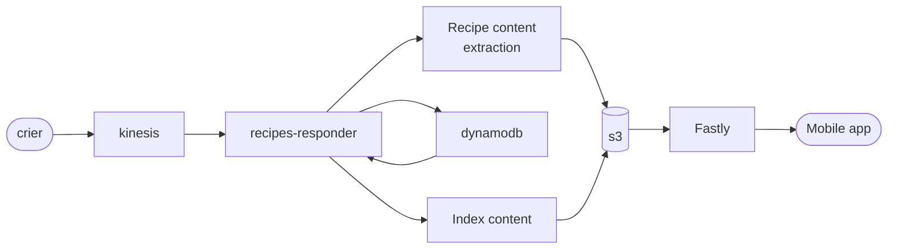

# Recipes API / Recipes Backend

## What is this?

This is a backend service that translates data from the Content API into a format that apps like 
https://github.com/guardian/ios-feast can use.

## Running CDK

The CDK stack is integrated with `nx`, so the regular "npm run synth" in the cdk directory won't work.

Instead, you can do:

```bash
npm run build
```

To build _everything_, including the CDK.

```bash
npm test
```

Will run the tests on everyhing, including CDK (therefore it will fail if the CDK snapshot is out of sync)

```bash
npm run update-cdk
```

Will update the CDK snapshot and allow the tests to pass again

## How does it work?


- The recipes-responder lambda function receives updates from the Crier kinesis stream
- Anything which is not an article update/takedown is ignored
- Each article update is scanned to find any recipe elements in the article
- We take a SHA of the recipe content so we can detect changes
- The list of recipes (with SHA identifiers) is compared against the list of recipes we already have for that article ID
  - If a recipe SHA does not exist, then it's been removed or updated => we remove its content from the bucket and its entry from the database
- We then take the list of "new" recipes (updated or newly inserted), output their content to S3 and register them in the database
- Explicit CDN flushes are performed for each S3 put/delete
- As we do this, we keep count of the total number of inserts + deletions
- If we have made any inserts or deletions, we scan the index table and output the results as JSON to an `index.json` file in the S3 bucket. Then cache-flush that too.

## How is it used?

- The static S3 bucket is fronted by a Fastly cache distribution.
- The app client makes a HEAD request to `/index.json`, including the `If-Modified-Since` header with the timestamp of the last successful update
  - If no update has taken place, the client receives `304 Not Modified` and can wait for the next poll. No data body is transferred.
  - If an update has taken place since the last update, the client receives `200 OK` with a `Content-Length` header.  It can then decide when/how to obtain the whole content
- If an update has taken place, the client downloads `/index.json` with a GET request.
- It then compares the list of version IDs (SHAs, in reality) of each recipe with the one it has locally
  - If the SHA matches then no action needs to be taken
  - If the index has a SHA not in the local database then the content must be downloaded. This is done via `GET /content/{sha}`.
  - If the load database has a SHA that is not in the index then the local version must be deleted.

The underlying assumption is that under "normal operation" there will only be one or two recipe changes in each update, so we minimise the data transfer
inherent in checking for them.  Furthermore, it's important the the app can work without a persistent internet connection so we don't know how big/small the change delta is.

### Why no search API?

Because it's not (yet) a client requirement.  At the time of writing, the desire is to do all searching client-side because the app feature-set is very much up in the air.

This may be revisited in future.

## What's in the box?

### lambda/recipes-responder

This is the lambda function which listens to Kinesis updates from crier.  It is responsible for all of the processing and extraction logic, although
most of the actual logic lives in the library code imported into it

### lambda/test-indexbuild

A lambda function that rebuilds the index on-demand.  This is incorporated from initial testing and will probably be removed.

### lib/capi

Library functions to communicate with the Content Application Programmer's Interface.  This is imported into the lambda code as `@recipes-api/lib/capi`.

### lib/recipes-data

Library functions that hold the actual logic for processing the content.  Parsing of the incoming Thrift content is done by the `@guardian/content-api-models/crier`
library; these functions take in data structures defined by the Thrift models and perform inspection, checksumming, databasing, storage and CDN interfacing.

### tools/manual-takedown

Runnable script that allows you to forcibly remove all recipes from a given article ID.  This can be run from an npm script: `npm run manual-takedown`.

### tools/fill-db

Runnable script that fills the index table with junk data.  This is from initial testing and will be removed, don't use it.
